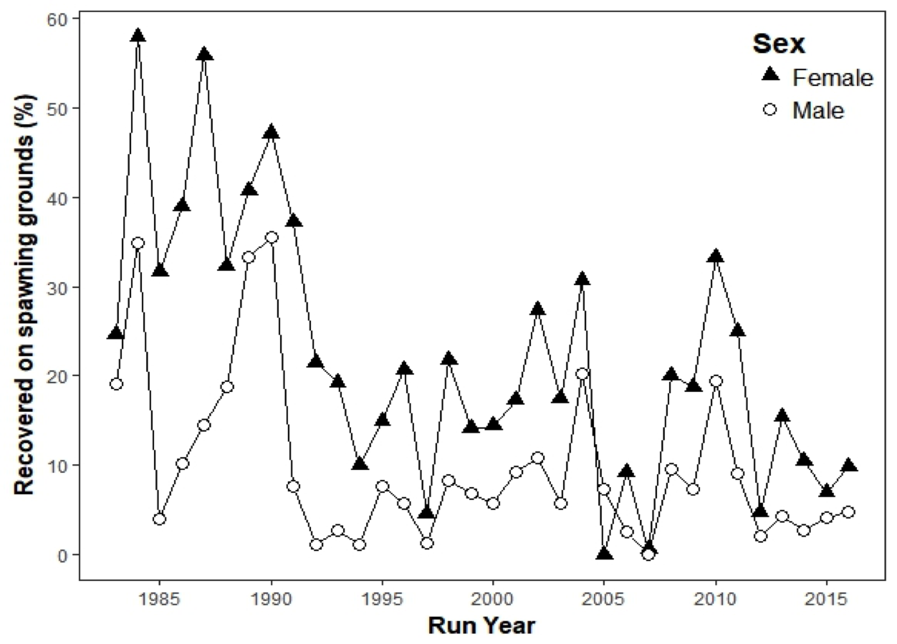

```{r setup, include=FALSE}
knitr::opts_chunk$set(echo = TRUE)
```

# Trends in time series

Trends in time series can be estimated via simple linear regression where, for a value $x$ measured at time $t$,

$$
x_t = \alpha + \beta t + \epsilon_t.
$$

However, any estimates of the significance of $\alpha$ or $\beta$ will be biased due to non-independence in the observation errors $\epsilon_t$.

## Random walks

In a normal random walk, the value at time $t$ equals that at time $t-1$ plus or minus some random error, which are often assumed to be Gaussian. Specifically,

\begin{equation} \label{eqnRW}
x_t = x_{t-1} + \epsilon_t,
\end{equation}

and $\epsilon_t \sim \text{N}(0,\sigma)$. Random walks are characterized by long deviations into positive or negative space, but there is no overall tendency to go up or down (Figure 1).

\vspace{0.25in}

```{r rw_plot, echo=FALSE, fig.width=6, fig.height=3, fig.cap="Example of a random walk with Guassian errors."}
set.seed(123)
ww <- rnorm(50)
xx <- cumsum(ww)
plot.ts(xx, ylab=expression(italic(x[t])))
```

## Biased random walk

An alternative is to assume the observations follow a so-called "biased random walk". In a biased random walk, the value at time $t$ is still a function of that at time $t-1$ plus or minus some random error. However, there is also an overall tendency (bias) to travel in a generally upward or downward direction (Figure 2). Specifically,

\begin{equation} \label{eqnBRW}
x_t = x_{t-1} + \mu + \epsilon_t,
\end{equation}

$\mu$ is the bias, and $\epsilon_t \sim \text{N}(0,\sigma)$.

\vspace{0.25in}

```{r Brw_plot, echo=FALSE, fig.width=6, fig.height=3, fig.cap="Example of a biased random walk with Guassian errors."}
set.seed(123)
ww <- xx <- rnorm(50)
for(t in 2:50) {
  xx[t] <- 0.15 + xx[t-1] + ww[t]
}
plot.ts(xx, ylab=expression(italic(x[t])))
```

# Example: Straying in salmon

There may be a tendency for stray rates in salmon to increase or decrease over time given genetic and environmental effects. In the current case (Figure 3), there indeed appears to be a downward trend in the data.

Because we typically assume Gaussian errors in random walks, but the data lie on the unit interval $[0,1]$, we must use some form of "link" in our model. The most common choice is the logit function, which maps $[0,1]$ onto $(-\infty, \infty)$. Our biased random walk model would then become

\begin{equation} \label{eqnLBRW}
y_t = y_{t-1} + \mu + \epsilon_t,
\end{equation}

where $y_t = \text{logit}(x_t)$. 

```{r obs_ts, echo=FALSE, fig.align='center', fig.cap="Observed salmon stray rates in the Elk River, Oregon.", out.width = '70%'}

```

In this case there are also data for two sexes, so if we assume different trends/biases for each of them, then we have

\begin{align} \label{eqnLBRWs}
y_{f,t} &= y_{f,t-1} + \mu_f + \epsilon_{f,t} \\
y_{m,t} &= y_{m,t-1} + \mu_m + \epsilon_{m,t}.
\end{align}

\begin{equation} \label{eqnLBRWs}
y_{s,t} = y_{s,t-1} + \mu_s + \epsilon_{s,t},
\end{equation}

## Requirements

```{r load_up, eval=FALSE}
library(readr)
```


# The data

```{r read_data, eval=FALSE}
## dat <- read_csv()
```


# The analysis

```{r ssm, eval=FALSE}

```

